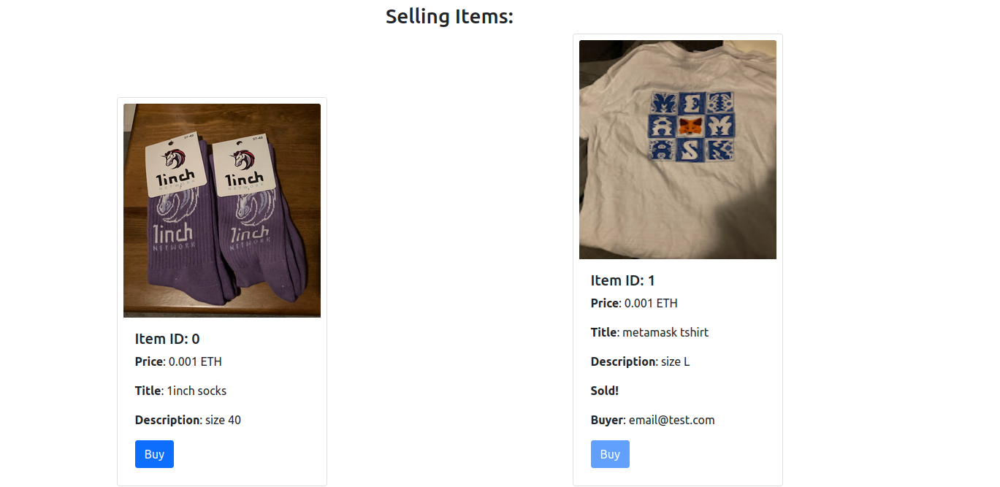

# Crypto MarketPlace
demo: https://ethglobal.filipelucas.com/


This projects aims to create a proof of concept of a MarketPlace that runs on web3.

Similar to Amazon but instead of using the traditional payment system to verify transactions,
it uses the blockchain to verify who bought the items.

All items info are stored in a smart contract, storing the following information:
* price
* title
* description
* image url
* paid status
* seller address
* buyer identifier (example: email)

The project is using the Linea Test Network so it uses the MetaMask SDK to propmt the user to change to the correct network.

## TechStack:
* [MetaMask SDK](https://metamask.io/sdk/)
  * ask user to change to the Linea network
  * if the MetaMask extension is not installed the SDK ask the user to install it
* [Linea](https://linea.build/)
  * the smart contract is deployed in the LineaNetwork

## Smart Contract
The smart contract developed for this POC has the following methods:

```
// gets the items stored in the smart contract
function getAllItems() external view  returns(int[] memory ids, address[] memory sellers, bool[] memory payed, int[] memory prices, string[] memory buyers, string[] memory titles, string[] memory descriptions, string[] memory URLImages)

// pay for the item storing the relation between the email and the item id
function pay(uint itemID, string memory buyer) public payable

// putting an item to sell with the item info
function storeItem(int price, address seller, string memory title, string memory description, string memory URLImage) public
```

## Seller

Can submit items to sell through a form.
After filling the form and click "Sell item" the wallet will pop up
to pay the gas fee to submit the item in the smart contract:


The page fetch the items from the smart contract and list them:


## Buyer
A customer can buy an item by clicking "Buy",
after click the button a pop up will appear asking for the email
and then the wallet will pop up 
so the buyer can transfer the value to the contract method
so it stores the email in the smart contract with the item.


After the payment the value is tranfered to the seller address
and the item is flagged as bought on the smart contract.
After the item is bough it appears with the "Buy" button disabled
and shows the buyer email.
